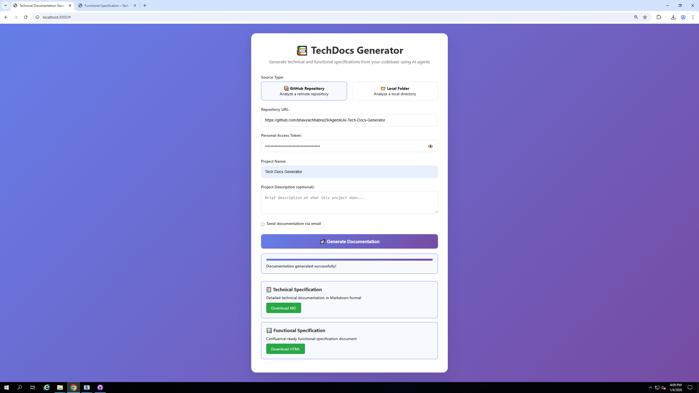
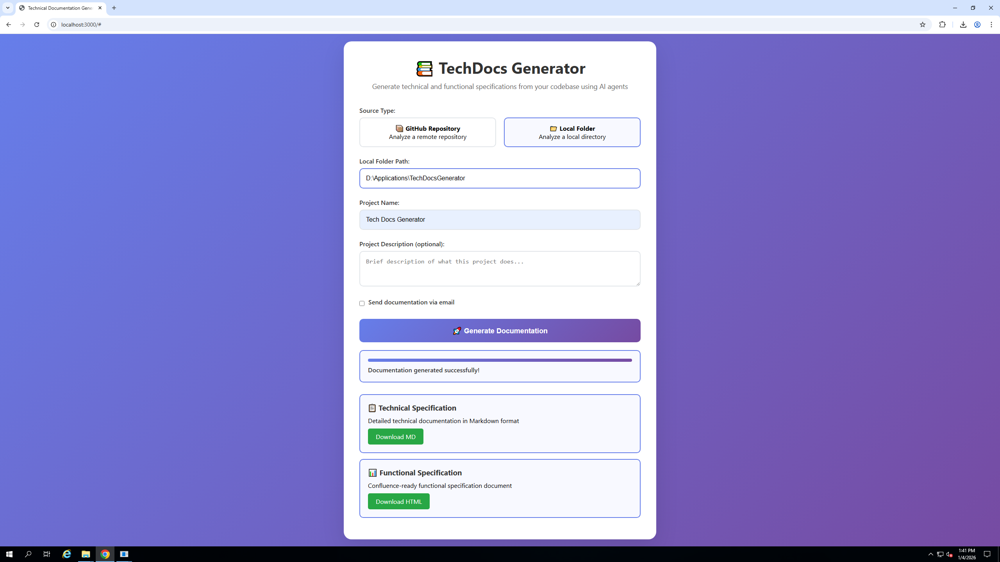
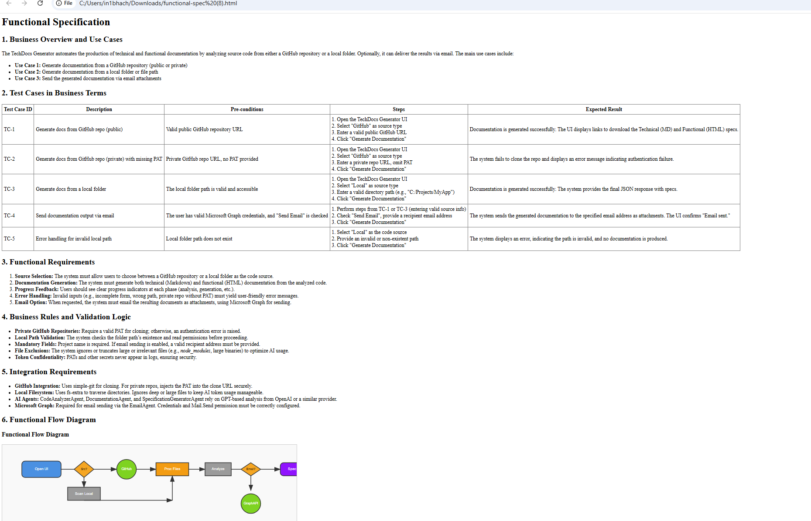

# TechDocs Generator

A multi-agent TypeScript web application for automatically generating comprehensive technical and functional specifications from GitHub repositories or local folders using AI-powered analysis.


### TechDocs Generator Interface Github


### TechDocs Generator Interface Local Folder


## Features

### 🤖 Multi-Agent Architecture
- **Code Analyzer Agent**: Analyzes code structure, patterns, and architecture
- **Documentation Agent**: Extracts functional requirements and business logic from code analysis
- **Specification Generator Agent**: Creates professional technical and functional specifications with visual diagrams
- **Email Agent**: Sends generated documentation via Microsoft Graph API with attachments
- **Coordinator Agent**: Orchestrates all agents and manages the documentation workflow

### 📋 Document Generation
- **Technical Specifications**: Detailed technical documentation in Markdown format with class diagrams
- **Functional Specifications**: Business requirements and test cases in HTML format with functional flow diagrams
- **Visual Flow Diagrams**: SVG-based diagrams showing user workflows and system interactions
- **Class Diagrams**: Text-based class relationship diagrams in technical specifications
- **Automatic Analysis**: Identifies programming languages, frameworks, and architecture patterns

### Generated Technical Specification Example


### Generated Functional Specification Example


### 📧 Email Integration
- Send documentation automatically via Microsoft Graph API
- Professional AI-generated email templates with project summaries
- Attachments include both technical (.md) and functional (.html) specifications
- Secure authentication using Microsoft 365 OAuth2

### 🔗 Repository Support
- **GitHub Integration**: Public and private repositories with PAT support via GitHub REST API
- **Local Folders**: Analyze projects on your local file system
- **Smart File Filtering**: Automatically excludes non-relevant files (node_modules, etc.)
- **No Git Dependency**: Uses GitHub API directly - no need to install Git locally

## Technology Stack

- **Frontend**: TypeScript, HTML, CSS (Vanilla - no framework dependencies)
- **AI Integration**: Vercel AI SDK with OpenAI o1-2024-12-17 model
- **Email**: Microsoft Graph API with MSAL authentication
- **Repository Analysis**: GitHub REST API for repository access (no Git installation required)
- **File Processing**: fs-extra for local file system operations
- **Server**: Node.js HTTP server for API endpoints

## Setup Instructions

### 1. Install Dependencies
```bash
npm install
```

**Note**: No Git installation required! The application uses GitHub's REST API to access repositories directly.

### 2. Environment Configuration
Copy the environment template and configure your settings:
```bash
cp .env.example .env
```

Edit `.env` with your actual values:
```env
# OpenAI/LLM Configuration - o1 Model
OPENAI_API_KEY=your-actual-openai-api-key
OPENAI_BASE_URL=your-o1-model-deployment-base-url
OPENAI_API_VERSION=2025-04-01-preview
LLM_MODEL=o1-2024-12-17
LLM_MAX_COMPLETION_TOKENS=4000

# Microsoft Graph Configuration for Email
MICROSOFT_CLIENT_ID=your-microsoft-client-id
MICROSOFT_CLIENT_SECRET=your-microsoft-client-secret
MICROSOFT_TENANT_ID=your-microsoft-tenant-id
EMAIL_FROM=your-email@domain.com

# Optional: GitHub Configuration
GITHUB_TOKEN=your-actual-github-token
```

### 3. Build the Application
```bash
npm run build
```

### 4. Run the Application
```bash
npm run serve
```

The application will be available at `http://localhost:3000`

## Usage

### Web Interface
1. **Choose Source**: Select between GitHub repository or local folder
2. **Configure Input**:
   - **GitHub**: Enter repository URL and PAT (if private)
   - **Local**: Enter the full path to your project folder
3. **Project Details**: Provide project name and description
4. **Email Options** (Optional): 
   - Check "Send documentation via email"
   - Enter recipient email address
5. **Generate**: Click "Generate Documentation" to start the process

### Email Features
- AI-generated professional email templates
- Technical specification attached as `.md` file
- Functional specification attached as `.html` file with interactive SVG diagrams
- Email content includes project summary and analysis metadata
- Secure Microsoft Graph API integration

## Multi-Agent Process

The application uses a sophisticated multi-agent pattern:

1. **Analysis Phase**:
   - Code Analyzer Agent examines source code structure
   - Documentation Agent extracts existing docs and comments

2. **Review Phase**:
   - Coordinator Agent reviews and synthesizes analysis
   - Ensures comprehensive and accurate insights

3. **Generation Phase**:
   - Specification Generator Agent creates final documents with visual diagrams
   - Technical specs include class diagrams in text format
   - Functional specs include SVG flow diagrams and test cases
   - Email Agent generates professional communication using Microsoft Graph (if requested)

4. **Delivery Phase**:
   - Documents made available for download via web interface
   - Email sent with attachments using Microsoft Graph API (if configured)
   - Visual diagrams embedded in HTML specifications

## Configuration Options

### LLM Settings
- Model: o1-2024-12-17 (OpenAI's latest reasoning model)
- Max Completion Tokens: Configurable based on content requirements
- API Version: 2025-04-01-preview
- Note: o1 model does not support temperature parameter

### Document Generation
- **Technical Specs**: Include class diagrams, system architecture, and API documentation
- **Functional Specs**: Include test cases, business rules, and interactive SVG flow diagrams
- **Visual Diagrams**: Self-contained HTML/CSS/SVG without external dependencies


### File Analysis
- Supported Languages: 20+ programming languages
- Framework Detection: Automatic identification of popular frameworks
- Smart Filtering: Excludes binary files and build artifacts
- **GitHub API Integration**: Direct repository access without local Git installation
- **Rate Limiting Awareness**: Optimized API calls to respect GitHub rate limits

## Development

### Scripts
- `npm run build`: Compile TypeScript
- `npm run dev`: Watch mode for development
- `npm run serve`: Serve the built application
- `npm start`: Run the Node.js backend

### Project Structure
```
src/
├── agents/           # Multi-agent system
│   ├── base-agent.ts                    # Base agent class with AIClient
│   ├── code-analyzer-agent.ts           # Code analysis agent
│   ├── documentation-agent.ts           # Functional analysis agent
│   ├── specification-generator-agent.ts # Spec generation with diagrams
│   ├── email-agent-graph.ts             # Microsoft Graph email integration
│   ├── coordinator-agent.ts             # Agent orchestration
│   └── index.ts                         # Agent exports
├── assets/           # Screenshots and examples
│   ├── TechDocsGenerator1.png
│   ├── TechDocsGenerator_GeneratedTechSpecs_Example.png
│   └── TechDocsGenerator_GeneratedFuncSpecs_Example.png
├── config/           # Configuration management
│   └── index.ts                         # Environment config with validation
├── repository-analyzer.ts               # GitHub API and file system analysis
├── server.ts                           # HTTP server with API endpoints
├── index.ts                            # Main application logic
└── app.ts                              # Client-side interface
```

## Environment Variables

| Variable | Description | Default |
|----------|-------------|---------|
| `OPENAI_API_KEY` | OpenAI API key for o1 model access | Required |
| `OPENAI_BASE_URL` | o1 model endpoint URL | o1 model endpoint url |
| `OPENAI_API_VERSION` | API version for o1 model | 2025-04-01-preview |
| `LLM_MODEL` | AI model to use | o1-2024-12-17 |
| `LLM_MAX_COMPLETION_TOKENS` | Maximum completion tokens | 4000 |
| `MICROSOFT_CLIENT_ID` | Microsoft Graph client ID | Required for email |
| `MICROSOFT_CLIENT_SECRET` | Microsoft Graph client secret | Required for email |
| `MICROSOFT_TENANT_ID` | Microsoft tenant ID | Required for email |
| `EMAIL_FROM` | Sender email address | Required for email |
| `GITHUB_TOKEN` | GitHub PAT for private repos | Optional |

## Microsoft Graph Setup

For email functionality, you need to configure Microsoft Graph API. See [GRAPH_SETUP.md](GRAPH_SETUP.md) for detailed setup instructions.

## Security Notes

- Store sensitive credentials in `.env` file (never commit to version control)
- Use GitHub PATs with minimal required permissions (read access only)
- Microsoft Graph credentials should use app registration with limited scopes
- All API keys should be kept secure and rotated regularly
- o1 model API key should be protected as it provides access to advanced AI capabilities
- **GitHub API Security**: Direct API access is more secure than Git cloning with embedded tokens

## Generated Output Examples

The application generates two types of specifications:

### Technical Specifications
- System architecture overview
- Class diagrams showing relationships
- Technology stack analysis
- API documentation
- Security considerations

### Functional Specifications  
- Business overview and use cases
- Test cases in business-friendly language
- Interactive SVG flow diagrams
- Business rules and validation logic
- Integration requirements

Both specifications are professionally formatted and ready for technical documentation or business stakeholder review.

## Support

For issues or questions regarding this application, please contact the development team.
